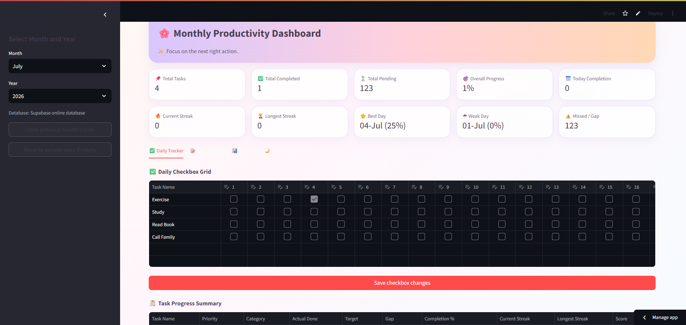
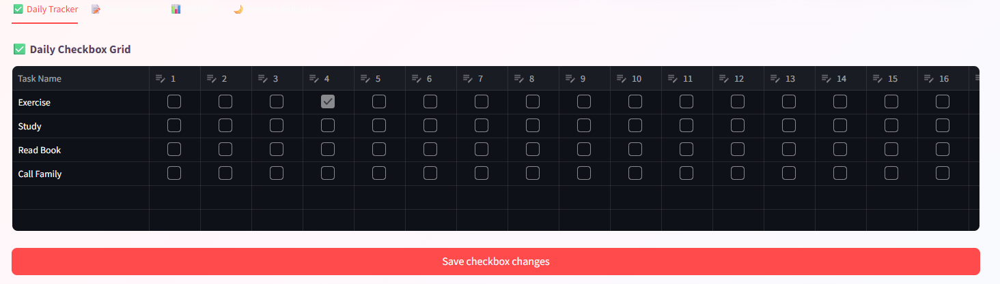
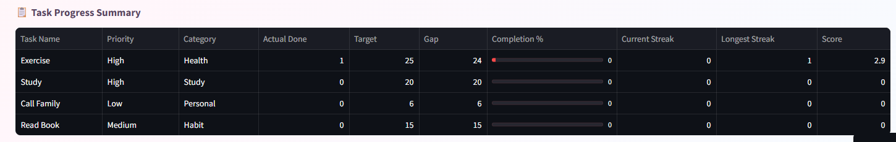
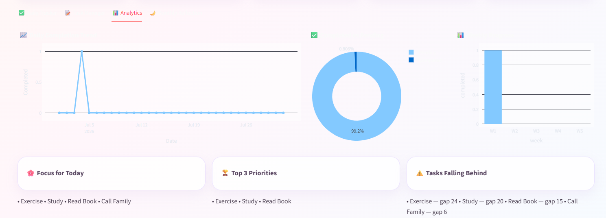
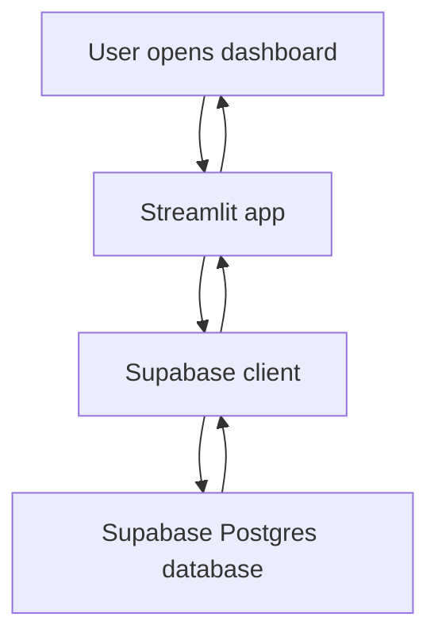

# Mochu Productivity Dashboard

A simple Streamlit dashboard for tracking daily tasks, monthly progress, and personal reflections. The main idea behind this project was to move a productivity tracker from a local/manual format into a small web app that can be opened from any device and still remember the saved task status.

The dashboard uses Streamlit for the interface and Supabase as the database, so task data is not lost when the website is refreshed, reopened, or goes to sleep on Streamlit Cloud.



## Why I Built This

I wanted a lightweight productivity dashboard that works like a monthly habit and task tracker, but without depending on Excel files or one specific laptop. The dashboard lets a user select a month and year, add tasks, mark daily completion, and save reflections in a structured way.

The project focuses on three things:

- keeping the interface simple enough for daily use
- saving data permanently in a cloud database
- making the app easy to deploy and access through a browser

## Main Features

### Monthly Task Tracking

The dashboard allows month-wise and year-wise task tracking. A user can choose a month and year, add tasks, and mark completion for each day.



This section is useful for checking consistency across the month instead of only tracking one day at a time.

### Task Completion State

Each task completion is saved in Supabase. That means if the user refreshes the page, changes the month, or opens the app later from another device, the saved status remains available.



### Reflections

The dashboard also includes a reflection section where the user can write notes or observations for a selected period. This makes the tracker more useful than a checklist because it also captures context behind the progress.



### Cloud Deployment

The app is deployed using Streamlit Community Cloud. Code is stored in GitHub, while private credentials are stored in Streamlit Cloud Secrets.

The website may go to sleep after inactivity, but it can be woken up by any user who has access to the app link. Since data is stored in Supabase, the saved tasks and reflections remain safe even if the Streamlit app sleeps.

## Project Architecture



In simple terms:

1. The user opens the Streamlit dashboard.
2. Streamlit shows the selected month, tasks, checkboxes, and reflections.
3. When the user adds or updates something, the app sends the change to Supabase.
4. Supabase stores the data in database tables.
5. When the app is opened again, the saved data is fetched back into the dashboard.

## Tools and Technologies Used

| Tool / Technology | Purpose |
|---|---|
| Python | Core programming language used for the app |
| Streamlit | Frontend and app framework for building the dashboard |
| Pandas | Data handling and table-style operations |
| Plotly | Charts and visual elements, where required |
| Supabase | Cloud database and backend storage |
| PostgreSQL | Database system behind Supabase |
| Git | Version control |
| GitHub | Code hosting |
| Streamlit Community Cloud | Free cloud deployment for the app |

## Folder Structure

```text
mochu_streamlit_dashboard/
├── app.py
├── requirements.txt
├── runtime.txt
├── schema.sql
├── README.md
├── .gitignore
├── .streamlit/
│   └── secrets.toml.example
└── assets/
    ├── dashboard-home.png
    ├── monthly-tracker.png
    ├── task-completion.png
    └── reflections.png
```

### Important Files

| File | Description |
|---|---|
| `app.py` | Main Streamlit application file |
| `requirements.txt` | Python libraries required to run the project |
| `runtime.txt` | Python version used by Streamlit Cloud |
| `schema.sql` | SQL script for creating the required Supabase tables |
| `.gitignore` | Prevents sensitive/local files from being pushed to GitHub |
| `.streamlit/secrets.toml.example` | Example format for required Streamlit secrets |

## Database Setup

The project uses Supabase tables for storing tasks, completions, and reflections. The database schema is defined in:

```text
schema.sql
```

Before running the app with Supabase, the SQL script should be executed in the Supabase SQL Editor.

The app expects Supabase credentials in this format:

```toml
SUPABASE_URL = "https://your-project-id.supabase.co"
SUPABASE_KEY = "your-anon-public-key"
```

For local development, these values can be placed inside:

```text
.streamlit/secrets.toml
```

For deployment, they should be added in:

```text
Streamlit Cloud -> App Settings -> Secrets
```

## Running the Project Locally

Clone the repository:

```bash
git clone https://github.com/your-username/mochu-productivity-dashboard.git
cd mochu-productivity-dashboard
```

Create and activate a virtual environment:

```bash
python -m venv venv
```

On Windows:

```bash
venv\Scripts\activate
```

Install dependencies:

```bash
pip install -r requirements.txt
```

Run the app:

```bash
streamlit run app.py
```

The app should open at:

```text
http://localhost:8501
```

## Deployment Notes

The app is deployed on Streamlit Community Cloud using GitHub as the source repository.

Important deployment points:

- The main file path should be `app.py`.
- Python version should be selected from Streamlit Cloud advanced settings.
- Supabase credentials should be added only in Streamlit Cloud Secrets.
- The actual `.streamlit/secrets.toml` file should never be pushed to GitHub.

The `.gitignore` should include:

```gitignore
.streamlit/secrets.toml
venv/
__pycache__/
*.pyc
.env
```

## Security Notes

This project uses an anon/public Supabase key for app access. Even though this key is meant for frontend/client usage, it should still be handled carefully.

Do not push these files to GitHub:

```text
.streamlit/secrets.toml
.env
```

If a real key is accidentally pushed to GitHub, the safest action is to rotate/regenerate the key from Supabase and update the key in Streamlit Cloud Secrets.

## Current Limitations

- Streamlit Community Cloud apps may go to sleep after inactivity.
- The app needs Supabase to be configured before hosted usage.
- Private repo access on Streamlit Cloud may require GitHub permission changes.
- The app is designed for lightweight personal productivity tracking, not heavy multi-user enterprise use.

## Future Improvements

Some improvements that can be added later:

- user login and authentication
- weekly and monthly summary charts
- streak calculation
- export to Excel or CSV
- task categories or priority levels
- mobile layout refinements
- better admin controls for managing tasks

## Screenshots

Add the app screenshots inside an `assets/` folder using the file names below:

| Screenshot | File Name |
|---|---|
| Dashboard home page | `assets/dashboard-home.png` |
| Monthly tracking section | `assets/monthly-tracker.png` |
| Task completion view | `assets/task-completion.png` |
| Reflection section | `assets/reflections.png` |

Once those images are added and pushed to GitHub, they will automatically appear in this README.

## Author

Built by Rahul Ratusaria as a practical productivity dashboard using Python, Streamlit, Supabase, GitHub, and Streamlit Cloud.
